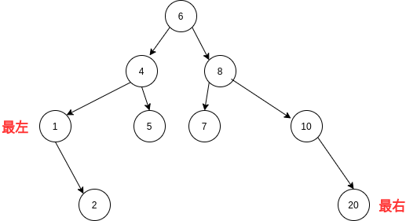
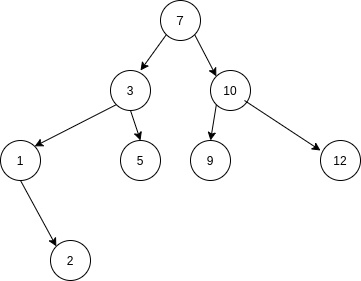

## Python数据结构之搜索二叉树(BST)

​		二叉搜索树也称二叉排序树或二叉查找树。二叉搜索树：一个二叉树，可以为空；如果不为空，满足一下性质（**整体到部分遵循左小右大原则**）。

1. 非空左子树的所有键值小于其根结点的键值。
2. 非空右子树的所有键值大于其根结点的键值。
3. 左、右子树都是二叉搜索树。

### BST插入

遵循左子树的值小于右子树的值原则进行插入操作

```python
def insert(self, node, val):
    """插入元素（递归）"""

    if node is None:
        node = TreeNode(val)
        node.left = node.right = None
    else:
        #  递归左右结点实现，并返回值进行构建树
        if val < node.val:
            node.left = self.insert(node.left, val)
        elif val > node.val:
            node.right = self.insert(node.right, val)

    return node
```

### BST查找

#### BST查找指定元素

- 递归方式

```python
def find(self, node, val):
    """查找结点(递归)"""

    if node is None:
        return

    if val < node.val:
        return self.find(node.left, val)
    elif val > node.val:
        return self.find(node.right, val)
    return node
```
- 迭代方式

```python
def iter_find(node, val):
    """查找结点(迭代)"""

    while node:
        if val > node.val:
            node = node.right
        elif val < node.val:
            node = node.left
        else:  # node.val == val
            return node

    return None
```

#### BST查找最大值和最小值

- 图示



- 查找最大值（最大值应位于树的最右面，其可能有左孩子或无孩子结点）

```python
    def find_min(self, node):
        """找出最小的值(递归)"""

        if node is None:  # 空BST
            return

        elif node.left is None:
            return node
        else:
            return self.find_min(node.left)
```

- 查找最小值（最小值应位于树的最左面，其可能有右孩子或无孩子结点）

``` python
    def find_max(node):
        """找出最大值(迭代)"""

        if node:
            while node.right:  # 遍历最右边的结点
                node = node.right
                
        return node
```

### BST删除

二叉树的删除需要考虑以下三种情况

１）要删除的是是叶结点：直接删除，并修改其父结点指向为空

２）要删除的结点只有一个孩子结点：将其父结点指向删除及结点的孩子结点。

３）要删除的结点有左右两棵子树：用另一个结点替代被删除的结点：**右子树的最小元素或者左子树的最大元素**。


```python
    def del_node(self, node, val):
        """删除结点"""

        if node is None:
            print("删除元素暂未找到")
		
        # 1.找删除结点
        elif val < node.val:
            node.left = self.del_node(node.left, val)  # 与删除后的新的结点进行连接
        elif val > node.val:
            node.right = self.del_node(node.right, val)
        else:
            # 2.删除结点有左右子树
            if node.left and node.right:
                tmp = self.find_min(node.right)  # 找寻右子树的最小结点值
                node.val = tmp.val  # 把结点元素的置换
                node.right = self.del_node(node.right, node.val)
            else:
                
                tmp = node
                # 3.删除结点有一个孩子结点或无孩子子结点
                if node.left is None:  # 有右孩子或无子结点
                    node = node.right
                elif node.right is None:  # 有左孩子或无子节点
                    node = node.left
                del tmp

        return node
```

### BST测试

实例图：



执行上述操作结果

```python
BST先序遍历： 7 3 1 2 5 10 9 12 
BST最小结点值： 1
BST最大结点值： 12
BST测试删除操作
****************************************
BST删除结点(右左右孩子)： 9 3 1 2 5 10 12 
BST删除结点(有一个子孩子)： 9 3 2 5 10 12 
BST删除结点(无子孩子)： 9 3 2 5 10 
****************************************
BST重新插入结点(7)： 9 3 2 5 7 10 
```

## 参考

[数据结构与算法--二叉排序树/二叉查找树/二叉搜索树 Python实现二叉排序树/二叉查找树/二叉搜索树的遍历、查找、删除 Python最简单的方式实现二叉排序树](https://blog.csdn.net/storyfull/article/details/103807464)

[中国大学mooc数据结构](https://www.icourse163.org/course/ZJU-93001)