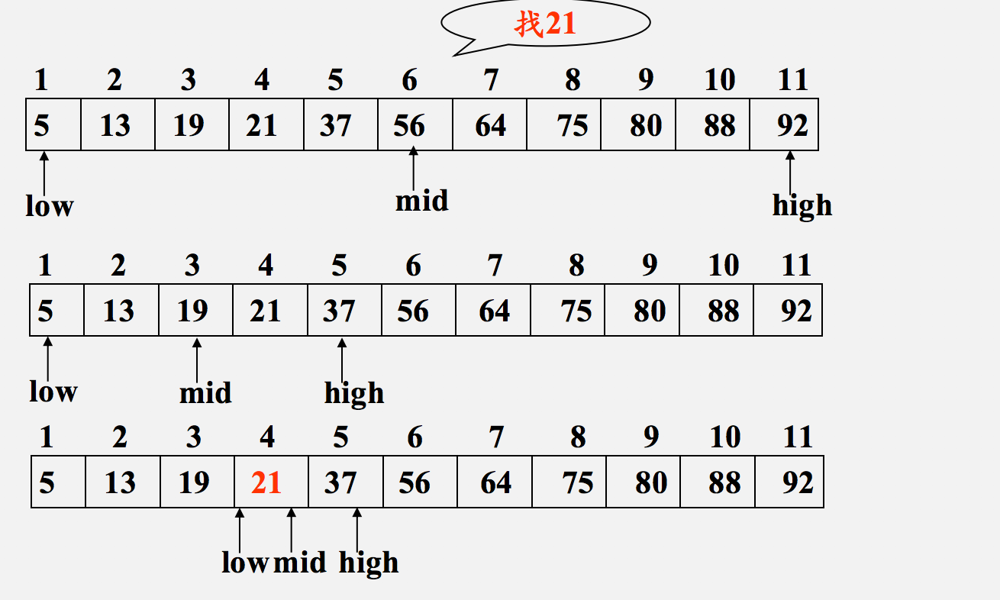

# Python剑指offer打卡-11

[toc]

## 把数组排成最小的数

- 问题描述

  ```
  问题描述：
  输入一个非负整数数组，把数组里所有数字拼接起来排成一个数，打印能拼接出的所有数字中最小的一个。
  
  实例：
  输入: [3,30,34,5,9]
  输出: "3033459
  
  说明：
  输出结果可能非常大，所以你需要返回一个字符串而不是整数
  拼接起来的数字可能会有前导 0，最后结果不需要去掉前导0
  
  解题方法：
  快速排序法
  ```

- 知识点

  快速排序

  

  动图演示：

  

  快速排序演示代码（[排序算法：快速排序【图解+代码】](https://www.bilibili.com/video/BV1bz411e7vY?from=search&seid=17579587592323875466)）：

  ```python
  class Solution:
      
      def quiclk_sort(self, nums, start, end):
          """快速排序法"""
          
          if start >= end:
              return 
          # 设置基准
          mid = nums[start]
          low = start
          hight = end
          while low < hight:
              # 左部分
              while low < hight and nums[low] < mid: low += 1
              # 右部分
              while low < hight and nums[hight] >= mid: hight -=1
              # 交换
              nums[low], nums[hight] = nums[hight], nums[low]
          
          # 交换基准
          nums[low] = mid
          # 递归子部分排序
          self.quiclk_sort(nums, start, low - 1)
          self.quiclk_sort(nums, low + 1, end)
  ```

- 代码

  ```python
  class Solution:
  
      def minNumber(self, nums):
  
          def quick(l, r):
              if l >= r:
                  return
  
              low, hight = l, r
              while low < hight:
                  while low < hight and strs[low] + strs[l] < strs[l] + strs[low]: low += 1
                  while low < hight and strs[hight] + strs[l] >= strs[l] + strs[hight]: hight -= 1
                  # change
                  strs[low], strs[hight] = strs[hight], strs[low]
              strs[low], strs[l] = strs[l], strs[low]
              quick(l, low - 1)
              quick(low + 1, r)
  
          strs = [str(c) for c in nums]
          quick(0, len(strs) - 1)
  
          return "".join(strs)
  
  
  if __name__ == "__main__":
      obj = Solution()
      print(obj.minNumber(nums=[3, 30, 34, 5, 9]))
  ```

## 统计一个数字在排序数组中出现的次数

- 问题描述

- 知识点

  二分法（[二分法查找](https://www.cnblogs.com/johnhery/p/9936335.html)）

  二分法查找适用于数据量较大时，但是数据需要<font color ="red">先排好顺序</font>。主要思想是：（设查找的数组区间为array[low, high]）
  
  
  
  二分查找演示代码
  
  ```python
  class Solution:
  
      def BinarySearch(self, array, t):
          # 二分查找算法必须有序
  
          low = 0
          height = len(array) - 1
  
          while low <= height:
              mid = (low + height) // 2
              if array[mid] > t:
                  height = mid - 1
              elif array[mid] < t:
                  low = mid + 1
              else:
                  return array[mid]
          return -1
  
  
  if __name__ == "__main__":
      obj = Solution()
      print(obj.BinarySearch([1, 2, 5, 7, 20], 20))
  ```
  
- 代码（[解题思路](https://leetcode-cn.com/problems/zai-pai-xu-shu-zu-zhong-cha-zhao-shu-zi-lcof/solution/)）
  
  ```python
  class Solution:
      def search(self, nums: List[int], target: int) -> int:
  
          def helper(tar):
              """寻找指定数值的右边界"""
  
              i, j = 0, len(nums) - 1
  
              while i<=j:
                  mid = (i + j) // 2
                  if nums[mid] <= tar:
                      i = mid + 1
                  else:
                      j = mid - 1
              return i   # 返回右边界的索引
          
          return helper(target) - helper(target - 1)
  ```
  
## 和为S的连续正数序列

- 问题描述

  ```
  问题描述：
  输入一个正整数 target ，输出所有和为 target 的连续正整数序列（至少含有两个数）。
  序列内的数字由小到大排列，不同序列按照首个数字从小到大排列。
  
  实例：
  输入：target = 15
  输出：[[1,2,3,4,5],[4,5,6],[7,8]]
  
  解题方法：
  1. 初始化： 左边界 i = 1i=1 ，右边界 j = 2j=2 ，元素和 s = 3s=3 ，结果列表 res ；
  2. 循环： 当 i≥j 时跳出；
      当 s > targets 时： 向右移动左边界 i = i + 1 ，并更新元素和 s ；
      当 s < targets 时： 向右移动右边界 j = j + 1，并更新元素和 s ；
      当 s = targets 时： 记录连续整数序列，并向右移动左边界 i = i + 1 ；
  3. 返回值： 返回结果列表 res ；
  ```

- 代码（[解题思路](https://leetcode-cn.com/problems/he-wei-sde-lian-xu-zheng-shu-xu-lie-lcof/solution/jian-zhi-offer-57-ii-he-wei-s-de-lian-xu-t85z/)）

  ```python
  class Solution:
  
      def findContinuousSequence(self, target):
  
          # 初始化连续区间
          i, j, s, res = 1, 2, 3, []
          while i < j:
              if s == target:
                  res.append(list(range(i, j+1)))
              if s >= target:
                  s -= i  # 先减后加
                  i += 1
              else:
                  j += 1  # 先加后减
                  s += j
  
          return res
  ```

  