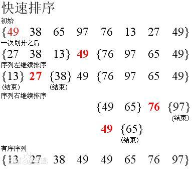

# Python剑指offer打卡-11

[toc]

## 把数组排成最小的数

- 问题描述

  ```
  问题描述：
  输入一个非负整数数组，把数组里所有数字拼接起来排成一个数，打印能拼接出的所有数字中最小的一个。
  
  实例：
  输入: [3,30,34,5,9]
  输出: "3033459
  
  说明：
  输出结果可能非常大，所以你需要返回一个字符串而不是整数
  拼接起来的数字可能会有前导 0，最后结果不需要去掉前导0
  
  解题方法：
  快速排序法
  ```

- 知识点

  快速排序

  

  动图演示：

  

  快速排序演示代码（[排序算法：快速排序【图解+代码】](https://www.bilibili.com/video/BV1bz411e7vY?from=search&seid=17579587592323875466)）：

  ```python
  class Solution:
      
      def quiclk_sort(self, nums, start, end):
          """快速排序法"""
          
          if start >= end:
              return 
          # 设置基准
          mid = nums[start]
          low = start
          hight = end
          while low < hight:
              # 左部分
              while low < hight and nums[low] < mid: low += 1
              # 右部分
              while low < hight and nums[hight] >= mid: hight -=1
              # 交换
              nums[low], nums[hight] = nums[hight], nums[low]
          
          # 交换基准
          nums[low] = mid
          # 递归子部分排序
          self.quiclk_sort(nums, start, low - 1)
          self.quiclk_sort(nums, low + 1, end)
  ```

- 代码

  ```python
  class Solution:
  
      def minNumber(self, nums):
  
          def quick(l, r):
              if l >= r:
                  return
  
              low, hight = l, r
              while low < hight:
                  while low < hight and strs[low] + strs[l] < strs[l] + strs[low]: low += 1
                  while low < hight and strs[hight] + strs[l] >= strs[l] + strs[hight]: hight -= 1
                  # change
                  strs[low], strs[hight] = strs[hight], strs[low]
              strs[low], strs[l] = strs[l], strs[low]
              quick(l, low - 1)
              quick(low + 1, r)
  
          strs = [str(c) for c in nums]
          quick(0, len(strs) - 1)
  
          return "".join(strs)
  
  
  if __name__ == "__main__":
      obj = Solution()
      print(obj.minNumber(nums=[3, 30, 34, 5, 9]))
  ```

## 统计一个数字在排序数组中出现的次数

