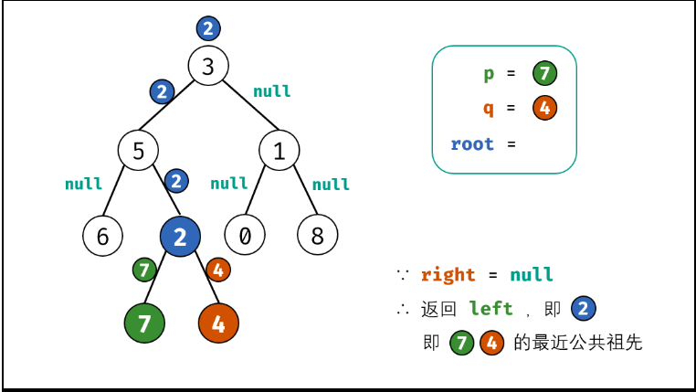

# Python剑指offer打卡13

[toc]

## 二叉树的最近公共祖先

==注意==:leetcode和牛客网对于本题的输入输出参数的要求。

- 问题描述

  ```python
  问题描述：
  给定一个二叉树, 找到该树中两个指定节点的最近公共祖先。
  最近公共祖先的定义： 设节点 root为节点p,q 的某公共祖先，若其左子节点 root.left和右子节点root.right 都不是p,q 的公共祖先，则称 root 是 “最近的公共祖先” 。
  
  解题方法：
  回朔法（后序遍历）
  ```

- 代码（[解题思路](https://leetcode-cn.com/problems/er-cha-shu-de-zui-jin-gong-gong-zu-xian-lcof/solution/mian-shi-ti-68-ii-er-cha-shu-de-zui-jin-gong-gon-7/)）

  

  ```python
  class Solution:
      def lowestCommonAncestor(self, root: TreeNode, p: TreeNode, q: TreeNode) -> TreeNode:
  
          # 回朔终点
          if not root or root == p or root == q:
              return root
  
          left = self.lowestCommonAncestor(root.left, p, q)
          right = self.lowestCommonAncestor(root.right, p, q)
          
          # 三种情况
          if not left: return right
          if not right: return left
  
          return root
  ```
  
- 牛客网
  
  ```python
  问题描述：
  给定一棵二叉树以及这棵树上的两个节点 o1 和 o2，请找到 o1 和 o2 的最近公共祖先节点。 
  
  参数说明：
  # @param root TreeNode类 
  # @param o1 int整型 
  # @param o2 int整型 
  # @return int整型
  ```
  
  ```python
      def lowestCommonAncestor(self , root , o1 , o2 ):
          # write code here
          def dfs(root, o1, o2):
              
              if not root or root.val == o1 or root.val == o2:
                  return root
              
              # 后序遍历
              left = dfs(root.left, o1, o2)
              right = dfs(root.right, o1, o2)
              
              # 如果left、right有一个为空，那么就返回不为空的哪一个
              if not left: return right
              if not right: return left
              #  如果left、right都不为空，那么代表o1、o2在root的两侧，所以root为他们的公共祖先
              
              return root
          
          return dfs(root, o1, o2).val
  ```
  

## 二叉搜索树的最近公共祖先

==注意==：区别与上一题，此处为二叉搜索树，遵循<font color ="blue">"左小右大"</font>>。

- 问题描述

  ```
  问题描述：
  给定一个二叉搜索树, 找到该树中两个指定节点的最近公共祖先。
  
  解题方法：
  遍历
  ```

- 代码

  ```python
  class Solution:
      def lowestCommonAncestor(self, root: 'TreeNode', p: 'TreeNode', q: 'TreeNode') -> 'TreeNode':
  
          if p.val > q.val:
              p, q = q, p
          
          while root:
              # 右子树（小于最小的）
              if root.val < p.val:
                  root = root.right
              # 左子树（大于最大的）
              elif root.val > q.val:
                  root = root.left
              else:
                  break
  
          return root
  ```

  

