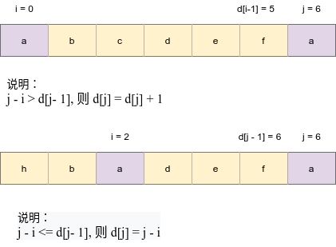

# Python剑指offer打卡-14

[toc]

## 最长不含重复字符的子字符串

### leetcode

注意：输入为字符串

- 问题描述

  ```
  问题描述：
  请从字符串中找出一个最长的不包含重复字符的子字符串，计算该最长子字符串的长度。
  
  实例：
  输入: "abcabcbb"
  输出: 3 
  解释: 因为无重复字符的最长子串是 "abc"，所以其长度为 3。
  
  注意：
  最长不含重复子串的长度
  ```

- 代码（[解题思路](https://leetcode-cn.com/leetbook/read/illustration-of-algorithm/5dz9di/)）

  转态转移图示：
  
  
  
  ```python
  class Solution:
      def lengthOfLongestSubstring(self, s: str) -> int:
          dic = {}
          res = tmp = 0
          for j in range(len(s)):
              i = dic.get(s[j], -1) # 获取索引 i
              dic[s[j]] = j # 更新哈希表
              tmp = tmp + 1 if tmp < j - i else j - i # dp[j - 1] -> dp[j]
              res = max(res, tmp) 
          return res
  ```

### 牛客网（最长无重复子串）

说明：输入为int型的list

- 问题描述

  ```
  问题描述：
  给定一个数组arr，返回arr的最长无的重复子串的长度(无重复指的是所有数字都不相同)。
  
  实例：
  输入：
  [2, 3, 4, 5]
  输出：
  ４
  ```

- 代码

  ```python
  class Solution:
      def maxLength(self , arr ):
          # write code here
          dic = {}
          res = tmp = 0
          for j in range(len(arr)):
              i = dic.get(str(arr[j]), -1)  # 获取i索引，最近重复字符，默认-1填充
              dic[str(arr[j])] = j  # 更新索引
              tmp = tmp + 1 if tmp < j - i else j - i
              res = max(res, tmp)
              
          return res
  ```


## n个骰子的点数

- 问题描述

  ```
  问题描述:
      把n个骰子扔在地上，所有骰子朝上一面的点数之和为s。输入n，打印出s的所有可能的值出现的概率。
  你需要用一个浮点数数组返回答案，其中第 i 个元素代表这 n 个骰子所能掷出的点数集合中第 i小的那个
  的概率。
  
  实例：
  输入: 1
  输出: [0.16667,0.16667,0.16667,0.16667,0.16667,0.16667]
  
  解题方法：
  动态规划
  dp[i - 1]的骰子对d[i + K]的的贡献度
  
  注意：
  输出结果（概率值）从小到大排序
  ```

- 代码

  ```python
  class Solution:
      
      def dicesProbability(self, n: int) -> List[float]:
          
          # 初始化骰子
          dp = [1.0 / 6.0] * 6
          for i in range(2, n + 1):
              # 骰子和个数
              tmp = [0] * (5 * i + 1)
              for j in range(len(dp)):
                  for k in range(6):
                      tmp[j + k] += dp[j]/6
  
              dp = tmp
  
          return dp
  ```

  

