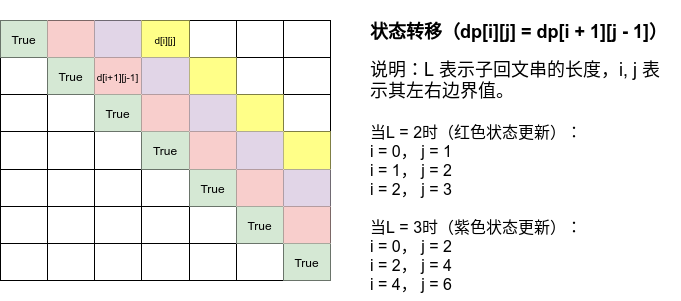
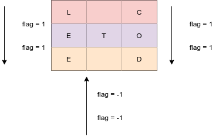

# Python剑指offer打卡-17

[toc]

## 最长回文子串

回文的意思是正着念和倒着念一样，如：==上海自来水来自海上==

- 问题描述

  ```
  问题描述：
  给你一个字符串 s，找到 s 中最长的回文子串。
  
  字符串的回文：
  	对于一个子串而言，如果它是回文串，并且长度大于 2，那么将它首尾的
  两个字母去除之后，它仍然是个回文串。例如对于字符串“ababa”，如果我们
  已经知道“bab” 是回文串，那么 “ababa” 一定是回文串，这是因为它的首
  尾两个字母都是a”。
  
  解题方法：
  动态规划
  (1)状态定义：d[i][j]表示s[i:j]为回文子串；
  (2)状态转移：d[i][j] = dp[i + 1][j - 1]，子问题是否为回文子串；
  (3)初始状态：dp[i][i] = True 表示只有一个字符时为回文子串；
  (4)返回值：最长的回文子串长度。
  时间复杂度O(n^2)
  空间复杂度O(n^2)
  ```

- 代码（[解题思路](https://leetcode-cn.com/problems/longest-palindromic-substring/solution/zui-chang-hui-wen-zi-chuan-by-leetcode-solution/)）

  图解：

  

  ```python
  class Solution:
      def longestPalindrome(self, s: str) -> str:
  
          n = len(s)
          if n < 2:
              return s
          
          # 保证最长回文
          max_len = 1
          begin = 0
          # 起始状态
          dp = [[False] * n for _ in range(n)]
          # 只有一个字符，本身为
          for i in range(n):
              dp[i][i] = True
          # 遍历可能的回文长度,起始长度为L = 2
          for L in range(2, n + 1):
              # 枚举左边界
              for i in range(n):
                  j = L + i - 1
                  if j >= n:
                      break
                  # 状态转移
                  if s[i] != s[j]:
                      dp[i][j] = False
                  else:
                      if j - i < 3:
                          dp[i][j] = True
                      else:
                          dp[i][j] = dp[i + 1][j - 1]
          
                   # 最长回文子串
                  if dp[i][j] and j - i + 1 > max_len:
                      max_len = j - i + 1
                      begin = i
          
          return s[begin: begin + max_len]
  ```

  

## Z字形变换

- 问题描述

  ```
  问题描述：
  将一个给定字符串 s 根据给定的行数 numRows ，以从上往下、从左到右进行 Z 字形排列。
  
  实例：
  输入：s = "PAYPALISHIRING", numRows = 4
  输出："PINALSIGYAHRPI"
  解释：
  P     I    N
  A   L S  I G
  Y A   H R
  P     I
  
  解题方法：
  遍历：从上向下（flag = 1）从下向上（flag = -1）
  时间复杂度：O(n)
  空间复杂度：O(n)
  ```

- 代码

  图解

  

  ```python
  class Solution:
      def convert(self, s: str, numRows: int) -> str:
  
          if numRows < 2:
              return s
          # 初始化行存储
          res = ["" for _ in range(numRows)]
          i, flag = 0, -1
          # 遍历存储
          for c in s:
              res[i] += c
              if i == 0 or i == numRows - 1:
                  flag = -flag
              i += flag
  
          return "".join(res)
  ```

## 整数反转

- 问题描述

  ```
  问题描述：
  给你一个 32 位的有符号整数 x ，返回将 x 中的数字部分反转后的结果。
  如果反转后整数超过 32 位的有符号整数的范围[−231, 231− 1] ，
  就返回 0。假设环境不允许存储 64 位整数（有符号或无符号
  
  
  解题方法：
  ```

- 代码

  ```python
  class Solution:
      def reverse(self, x: int) -> int:
          
          INT_MIN, INT_MAX = -2 ** 31, 2 ** 31 - 1
          rev = 0
          while x != 0:
              # 边界值考虑
              if rev < INT_MIN//10 + 1 or rev > INT_MAX//10:
                  return 0
              # 取余数
              # -19 % 10 = 1
              digit = x % 10
              if digit > 0 and x < 0:
                  digit -= 10
              # 求整数
              # -19 // 10 = -2
              x = (x - digit) // 10
  
              rev = rev * 10 + digit
  
          return rev
  ```

  
