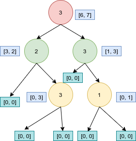
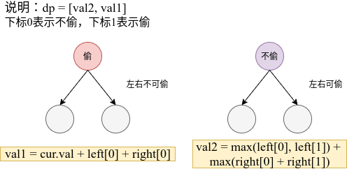
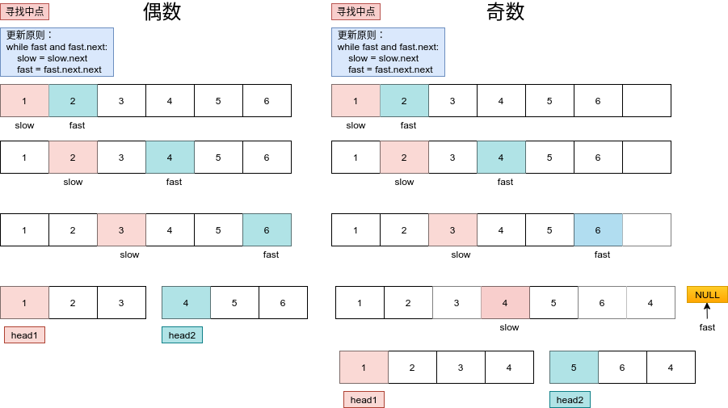

# Python剑指offer打卡-20

[toc]

## 打家劫舍III

- 问题描述

  ```
  问题描述:
      在上次打劫完一条街道之后和一圈房屋后，小偷又发现了一个新的可行窃的地区。这个地区
  只有一个入口，我们称之为“根”。 除了“根”之外，每栋房子有且只有一个“父“房子与之相连。
  一番侦察之后，聪明的小偷意识到“这个地方的所有房屋的排列类似于一棵二叉树”。 如果两个
  直接相连的房子在同一天晚上被打劫，房屋将自动报警。计算在不触动警报的情况下，小偷一晚
  能够盗取的最高金额。
  
  示例：
  输入: [3,2,3,null,3,null,1]
  
       3
      / \
     2   3
      \   \ 
       3   1
  
  输出: 7 
  解释: 小偷一晚能够盗取的最高金额 = 3 + 3 + 1 = 7.
  
  解题方法：
  树型动态规划(后序遍历)
  1. 转态定义： dp = [val1, val2] 下标0表示为不偷， 下标1表示为偷
  2. 状态转移： 如果当前节点能被偷，则有val2 = cur.val + left[0] + right[0]
  否则如果当前节点不能偷，则有val1 = max(left[0], left[1]) + max(right[0], right[0])
  3. 初始状态： dp = [0, 0]
  4. 返回值: max(dp[0], dp[1])
  时时间复杂度：O(n)
  空间复杂度：O()
  ```

  **实例->输入: [3,2,3,null,3,null,1] 输出->7**

  

- 代码（[解题方法](https://leetcode-cn.com/problems/house-robber-iii/solution/337-da-jia-jie-she-iiidong-tai-gui-hua-x-8t1e/)）

  

  ```python
  class Solution:
  
      def rob(self, cur: TreeNode) -> int:
          def dfs(cur):
              if not cur:
                  return [0, 0]
  
              left = dfs(cur.left)
              right = dfs(cur.right)
  
              # 状态转移
              # 当前节点不可偷
              val1 = max(left[0], left[1]) + max(right[0], right[1])
              # 当前节点可偷
              val2 = cur.val + left[0] + right[0]
              return [val1, val2]
  
          res = dfs(cur)
          return max(res[0], res[1])
  ```
  

## 回文链表

- 问题描述

  ```
  问题描述：
      请判断一个链表是否为回文链表。
  进阶：
  你能否用 O(n) 时间复杂度和 O(1) 空间复杂度解决此题？
  
  解题方法：
  （1）遍历
  使用有个临时数组对遍历节点数值进行存储，并比较
  时间复杂度：O(n)　遍历所有节点
  空间复杂度：O(n) 临时数组
  （2）快慢指针
      使用快慢指针寻找链表的中心位置，将链表进行分割l1和l2,并且
  l1链表的长度始终大于等于l1链表的长度，然后将l2链表进行翻转与l1
  链表进行比较。
  
  时间复杂度：O(n)　遍历所有节点
  空间复杂度：O(1) 没有使用额外空间
  
  注意：
  此题与链表翻转和排序链表知识点相同。
  ```

- 图解快慢指针取中点

  

- 代码（[解题思路](https://leetcode-cn.com/problems/palindrome-linked-list/solution/kuai-man-zhi-zhen-lian-biao-ni-xu-by-airesearcherj/)）

  ```python
  class Solution:
  
      def isPalindrom1(self, head):
          # 临时数组进行存储
          vars = []
          cur = head
          while cur:
              vars.append(cur.val)
              cur = cur.next
  
          return vars == vars[::-1]
  
      def isPalindrom2(self, head):
  
          if not head or not head.next:
              return True
          # 快慢指针
          slow, fast = head, head.next
          while fast and fast.next:
              fast = fast.next.next
              slow = slow.next
          cur = slow.next
          slow.next = None
          pre = None
          # 链表翻转
          while cur:
              tmp = cur.next
              cur.next = pre
              pre = cur
              cur = tmp
          # 比较回文
          while pre:
              if head.val != pre.val:
                  return False
              head = head.next
              pre = pre.next
  
          return True
  ```

  
