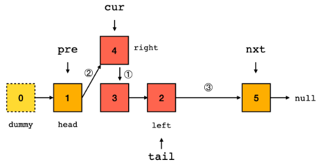

# Python剑指offer打卡-23

[toc]

## 反转链表II（<font color = red>重点</font>）

- 问题描述

  ```
  问题描述：
      给你单链表的头指针 head 和两个整数left和right ，其中left <= right。请你反转从位置 eft到位
  置 right 的链表节点，返回 反转后的链表。
  
  示例：
  输入：head = [1,2,3,4,5], left = 2, right = 4
  输出：[1,4,3,2,5]
  
  解题方法：
  穿针引线
  时间复杂度：O(N)
  空间复杂度:O(1)
  ```

- 代码（[解题思路](https://leetcode-cn.com/problems/reverse-linked-list-ii/solution/dong-hua-tu-jie-fan-zhuan-lian-biao-de-z-n4px/)）

  算法图解：

  

  ```python
  class Solution:
  
      def reverseBetween(self, head: ListNode, left: int, right: int) -> ListNode:
  
          # 申请哑节点
          dummmy = ListNode(0)
          dummmy.next = head
          # 记录
          count = 1
          pre = dummmy
          # 找到开头节点
          while pre.next and count < left:
              pre = pre.next
              count += 1
  
          cur = pre.next
          tail = cur
          # 局部翻转
          while cur and count <= right:
              nxt = cur.next
              # 节点插入连接
              cur.next = pre.next
              pre.next = cur
              # tail节点始终未变，只有指向在变换
              tail.next = nxt
              # 移动
              cur = nxt
              count += 1
  
          return dummmy.next
  ```


## 数组中的第K个最大元素

- 问题描述

  ```
  
  ```

- 代码

  快速排序

  ```python
  class Solution:
      def findKthLargest(self, nums: List[int], k: int) -> int:
  
          def quickSort(low, high):
              if low >= high:
                  return 
              
              # 设置边界条件
              i, j = low, high
              pivot = nums[i]
              while i < j:
                  while i < j and nums[j] >= pivot:
                      j -= 1
                  nums[i] = nums[j]
                  
                  while i < j and nums[i] < pivot:
                      i += 1
                  nums[j] = nums[i]
              nums[i] = pivot
              quickSort(low, i - 1)
              quickSort(i + 1, high)
          
          quickSort(0, len(nums) - 1)
  
          return nums[-k]
  ```

  改进的快速排序

  ```python
  class Solution:
      def findKthLargest(self, nums, k):
          # 快排
          self._k = len(nums) - k
          return self.quicksort(nums, 0, len(nums) - 1)
  
      def quicksort(self, nums, left, right):
          if left == right:
              return nums[left]
          pivot = self.partition(nums, left, right)
          if pivot == self._k:
              return nums[pivot]
          elif pivot < self._k:
              return self.quicksort(nums, pivot + 1, right)
          else:
              return self.quicksort(nums, left, pivot - 1)
  
      def partition(self, nums, left, right):
          pivot = nums[left]
          i, j = left, right
          while i < j:
              while i < j and nums[j] >= pivot:
                  j -= 1
              if i < j:
                  nums[i] = nums[j]
                  i += 1
              while i < j and nums[i] <= pivot:
                  i += 1
              if i < j:
                  nums[j] = nums[i]
                  j -= 1
          nums[i] = pivot
          return i
  ```


## x的平方根（<font color = red>重点</font>）

- 问题描述

  ```
  问题描述：
          实现int sqrt(int x)函数。计算并返回x的平方根，其中x 是非负整数。
  由于返回类型是整数，结果只保留整数的部分，小数部分将被舍去。
  
  解题方法：
  (1)袖珍计算器
  时间复杂度：O(1)
  空间复杂度：O(1)
  (2)二分法
  时间复杂度：O(logN)
  空间复杂度：O(1)
  ```

- 代码（[解题思路](https://leetcode-cn.com/problems/sqrtx/solution/x-de-ping-fang-gen-by-leetcode-solution/)）

  袖珍计算器

  ```python
  import math
  
  
  class Solution:
      def mySqrt(self, x: int) -> int:
          
          if x == 0:
              return 0
          ans = int(math.exp(0.5*math.log(x)))
  
          return ans + 1 if (ans + 1)**2 <= x else ans
  ```

  二分法

  ```python
  class Solution:
      
      def mySqrt(self, x: int) -> int:
          # 二分查找
  
          l, r, ans = 0, x, -1
          while l <= r:
              mid = (l + r) // 2
              if mid * mid <= x:
                  ans = mid
                  l = mid + 1
              else:
                  r = mid - 1
  
          return ans
  ```

  
