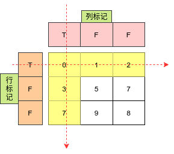
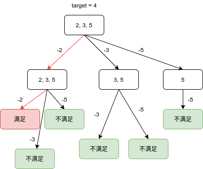
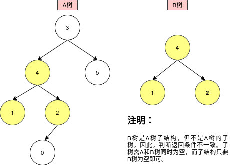

# Python剑指offer打卡-26

## 矩阵置零

题目类型：矩阵

题目难度：:star2:

- 问题描述

  ```
  问题描述：
  
      给定一个m x n 的矩阵，如果一个元素为 0 ，则将其所在行和列的所有元素都设为0。
  请使用原地算法。
  进阶：
      一个直观的解决方案是使用 O(mn)的额外空间，但这并不是一个好的解决方案。一个简
  单的改进方案是使用 O(m+n) 的额外空间，但这仍然不是最好的解决方案。你能想出一个仅
  使用常量空间的解决方案吗？
  
  解题方法：
  方法一：
  设置行列标记，行标记或者列标记为零时，元素置为零。
  时间复杂度：O(mn)
  空间复杂度：O(m + n)
  ```

- 代码

  算法图解

  

  ```python
  class Solution:
      def setZeroes(self, matrix: List[List[int]]) -> None:
          """
          Do not return anything, modify matrix in-place instead.
          """
  
          # 初始化
          m, n = len(matrix), len(matrix[0])
          rows, cols = [False] * m, [False] * n
  
          # 设置标记
          for i in range(m):
              for j in range(n):
                  if matrix[i][j] == 0:
                      rows[i] = cols[j] = True
  
          # 置零
          for i in range(m):
              for j in range(n):
                  if rows[i] or cols[j]:
                      matrix[i][j] = 0
  ```

## 组合总和

题目类型：DFS

题目难度：:star2::star2:

- 问题描述

  ```
  问题描述：
  	给定一个无重复元素的正整数数组 candidates 和一个正整数 target ，找出 candidates 中所有可以使数字和为目标数 target 的唯一组合。candidates 中的数字可以无限制重复被选取。如果至少一个所选数字数量不同，则两种组合是唯一的。 对于给定的输入，保证和为 target 的唯一组合数少于 150 个。
  	
  解题方法：
  DFS
  ```

- 代码

  算法图解

  

  ```python
  class Solution:
      def combinationSum(self, candidates: List[int], target: int) -> List[List[int]]:
  
          def dfs(candidates, begin, size, res, path, target):
  
              if target < 0:
                  return 
              
              if target == 0:
                  res.append(path)
              
              for index in range(begin, size):
                  dfs(candidates, index, size, res, path + [candidates[index]], target - candidates[index])
          
          size = len(candidates)
          if size < 0:
              return []
          
          res, path = [], []
          dfs(candidates, 0, size, res, path, target)
          
          return res
  ```

## 另一棵树的子树

题目类型：DFS

题目难度：:star2::star2:

- 问题描述

  ```
  问题描述：
  	给你两棵二叉树 root 和 subRoot 。检验 root 中是否包含和 subRoot 具有
  相同结构和节点值的子树。如果存在，返回 true ；否则，返回 false 。二叉树 tr
  ee 的一棵子树包括 tree 的某个节点和这个节点的所有后代节点。tree 也可以看
  做它自身的一棵子树。
  
  解题方法：
  DFS
  ```

- 代码

  算法图解

  

  ```python
  class Solution:
      def isSubtree(self, root: TreeNode, subRoot: TreeNode) -> bool:
  
          if not root and not subRoot:
              return True
          elif not root or not subRoot:
              return False
          
          return self.isSameTree(root, subRoot) or self.isSubtree(root.left, subRoot) or self.isSubtree(root.right, subRoot)
      
      def isSameTree(self, root1, root2):
          if not root1 and not root2:
              return True
          elif not root1 or not root2:
              return False
  
          return root1.val == root2.val and self.isSameTree(root1.left,\
                   root2.left) and self.isSameTree(root1.right, root2.right)
  ```

  