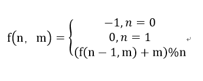
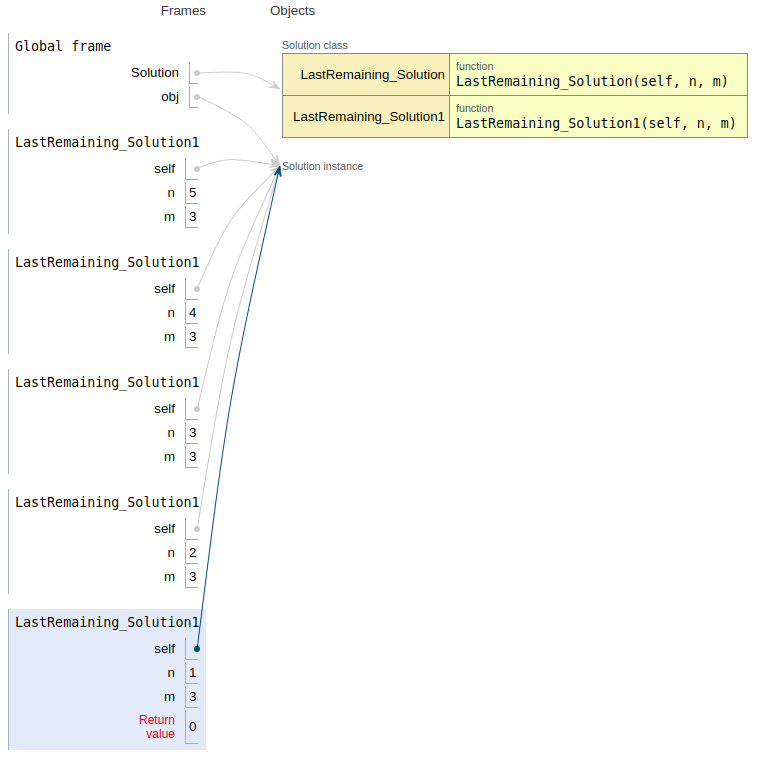
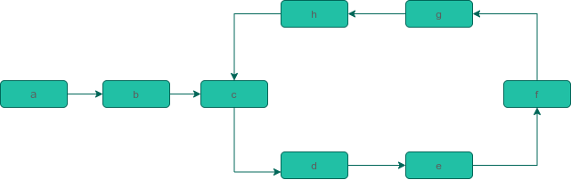
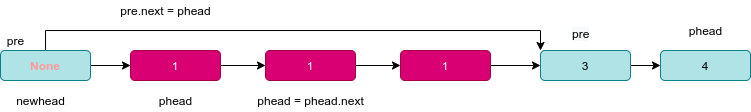

# 剑指offer打卡-4

[toc]

### 孩子们的游戏

- 问题描述

  ```python
  问题描述：
  有个游戏是这样的：首先，让小朋友们围成一个大圈。然后，随机指定一个数 m，让编号为 0 的小朋友开始报数
  。每次喊到 m-1 的那个小朋友要出列唱首歌，然后可以在礼品箱中任意的挑选礼物，并且不再回到圈中，从他的
  下一个小朋友开始，继续0…m-1报数…这样下去…直到剩下最后一个小朋友，可以不用表演，并且拿到终极大奖。请
  你试着想下，哪个小朋友会得到这份礼品呢？(注：小朋友的编号是从 0 到 n-1 ) 如果没有小朋友，请返回 -1
  解决方案：
  递归
  ```

  **递归公式**：

  

- 代码([解题思路](https://leetcode-cn.com/problems/yuan-quan-zhong-zui-hou-sheng-xia-de-shu-zi-lcof/solution/huan-ge-jiao-du-ju-li-jie-jue-yue-se-fu-huan-by-as/))

  ```python
  import sys
  sys.setrecursionlimit(1000000)  # 保证递归深度
  
  
  class Solution:
  
      def LastRemaining_Solution(self, n: int, m: i):
          """
          :param n:小孩数
          :param m: 指定编号
          :return:
          """
          if n < 1:
              return -1
  
          start = 0
          final = -1
          indexlist = list(range(n))  # 构造
  
          while indexlist:
              #  剔除位置
              k = (start + m - 1) % n
              n -= 1
              final = indexlist.pop(k)
              # print("final", final)
              #  删除上一元素之后，向前对其
              start = k
          return final
  
      def LastRemaining_Solution1(self, n: int, m: int):
  
          if n == 0:
              return -1
          if n == 1:
              return 0
          return (self.LastRemaining_Solution1(n - 1, m) + m) % n
      
         def lastRemaining(self, n, m):
          """迭代法"""‘
          
          x = 0
          for i in range(2, n + 1):
              x = (x + m) % i
        return x
  

  if __name__ == "__main__":
      obj = Solution()
      print(obj.LastRemaining_Solution(5, 3))
      print(obj.LastRemaining_Solution1(5, 3))
  ```
  
  **递归过程解析**：
  
  
### 链表中环的入口结点
- 问题描述

  ```python
  问题描述：
  给一个链表，若其中包含环，请找出该链表的环的入口结点，否则，输出null。
  
  解决方案：
  栈~
  ```

- 代码（[解题思路](https://leetcode-cn.com/problems/linked-list-cycle-ii/solution/linked-list-cycle-ii-kuai-man-zhi-zhen-shuang-zhi-/)）

- 

  ```python
  class ListNode:
  
      def __init__(self, val):
          self.val = val
          self.next = None
  
  
  class Solution:
  
      def EntryNodeOfLoopCollections(self, pHead):
          """链表环中第一个入口结点"""
          if pHead is None:
              return
  
          cur = pHead
          stack = []
          while cur:
              if cur not in stack:
                  stack.append(cur)
                  cur = cur.next
              else:
                  return cur
  
          return None
  ```


### 删除链表中的重复结点
- 问题描述

  ```python
  问题描述：
  在一个排序的链表中，存在重复的结点，请删除该链表中重复的结点，重复的结点不保留，返回链表头指针。
  解决方案：
  当删除重复结点时，直接遍历重复结点后，跳跃连接一前一后的结点
  前：１->1->2->3->4->5->6->6
  后：2->3->4->5
  ```

- 代码（[解题思路](https://leetcode-cn.com/problems/remove-duplicates-from-sorted-list-ii/solution/san-chong-jie-fa-duo-tu-zhan-shi-82-shan-chu-pai-x/)）

- 图示

- 

  ```python
  class ListNode:
  
      def __init__(self, val):
          self.val = val
          self.next = None
  
  
  class Solution:
  
      def deleteDuplication(self, pHead):
          # 申请新的头结点
          new_head = ListNode(None)
          new_head.next = pHead
          pre = new_head
  
          while pHead and pHead.next:
              if pHead.val == pHead.next.val:
                  tmp = pHead.val
                  # 删除重复的结点
                  while pHead and pHead.val == tmp:
                      pHead = pHead.next
                  # 结点删除后，重新连接结点
                  pre.next = pHead
              else:
                  # 一个在前一个在后
                  pre = pHead
                  pHead = pHead.next
          return new_head.next
  
      def deleteDuplication1(self, pHead):
          """递归实现"""
  
          if pHead is None:
              return None
          if pHead.next is None:
              return pHead
          if pHead.val != pHead.next.val:
              pHead.next = self.deleteDuplication1(pHead.next)
              return pHead
          else:
              # 设置临时结点，用来删除重复数值
              tempNode = pHead
              while tempNode and tempNode.val == pHead.val:
                  tempNode = tempNode.next
              return self.deleteDuplication1(tempNode)
  
      def show(self, pHead):
  
          if pHead is None:
              return None
  
          while pHead:
              print(pHead.val, end=" ")
              pHead = pHead.next
  ```
### 数组中次数超过一半的数字
- 问题描述

  ```python
  问题描述：
  数组中有一个数字出现的次数超过数组长度的一半，请找出这个数字。例如输入一个长度为9的数组{1,2,3,2,2,2,5,4,2}。
  由于数字2在数组中出现了5次，超过数组长度的一半，因此输出2。如果不存在则输出0。
  解决方案：
  1.字典{}
  ```
- 代码

  ```python
  class Solution:
  
      @staticmethod
      def MoreThanHalfNum_Solution(numbers):
  	"""字典统计重复数字"""
      
          count_dic = {}
          num_len = len(numbers)
          for item in numbers:
              if item in count_dic:
                  count_dic[item] += 1
              else:
                  count_dic[item] = 1
  
              if count_dic[item] > (num_len >> 1):
                  return item
  
          return 0
  
      @staticmethod
      def MoreThanHalfNum_Solution1(numbers):
          """基于排序算法"""
          length = len(numbers)
  
          if length == 0:
              return 0
          elif length == 1:
              return numbers[0]
          else:
              numbers.sort()
              num = numbers[int(length >> 1)]  # 中间位置的数据
              if numbers.count(num) > (length >> 1):
                  return num
              
              return 0
  ```

### 1～n 整数中 1 出现的次数

- 问题描述

  ```python
  问题描述：
  求出1 ~ 13的整数中1出现的次数，并算出100 ~ 1300的整数中1出现的次数？1~13中包含1的数字
  有1、10、11、12、13因此共出现6次，但是对于后面问题他就没辙了。请把问题更加普遍化，可以很
  快的求出任意非负整数区间中1出现的次数（从1 到 n 中1出现的次数）
  ```

- 代码（[解题思路](https://leetcode-cn.com/problems/1nzheng-shu-zhong-1chu-xian-de-ci-shu-lcof/solution/mian-shi-ti-43-1n-zheng-shu-zhong-1-chu-xian-de-2/)）

  ```python
  class Solution:
  
      def countDigitOne(self, n: int) -> int:
  
          # 初始化
          digit, res = 1, 0
          high, cur, low = n // 10, n % 10, 0
  
          # 遍历求解
          while high != 0 or low != 0:
              if cur == 0:
                  res += high * digit
              elif cur == 1:
                  res += high * digit + low + 1
              else:
                  res += (high + 1) * digit
              # 更新
              low += cur * digit
              cur = high % 10
              high = high // 10
              digit *= 10  # 进位
  
          return res
  ```


### 参考

[丑数](https://blog.csdn.net/ggdhs/article/details/90313512)

[VISUALIZE CODE EXECUTION](http://www.pythontutor.com/)

[数据结构与算法题目](https://blog.csdn.net/storyfull/category_9475477_2.html)

[剑指offer（python）](https://blog.csdn.net/ggdhs/category_8914921.html)