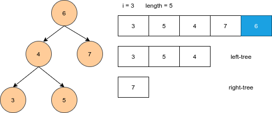
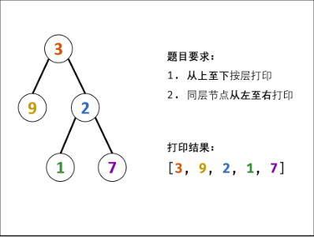
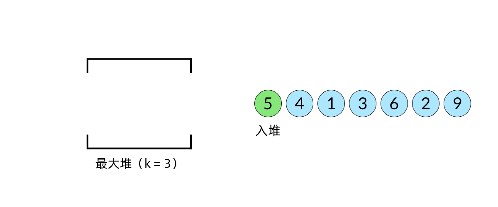

# Python剑指offer打卡-6

[toc]

## 二叉树中和为某一值的路径

- 问题描述

  ```python
  问题描述：
  输入一颗二叉树的根节点和一个整数，打印出二叉树中结点值的和为输入整数的所有路径。路径定义为从树
  的根结点开始往下一直到叶结点所经过的结点形成一条路径。(注意: 在返回值的list中，数组长度大的数
  组靠前).
  
  解决方案：
  递归
  ```

- 代码（[解题思路](https://leetcode-cn.com/problems/er-cha-sou-suo-shu-de-hou-xu-bian-li-xu-lie-lcof/solution/pythonti-jie-yi-dong-de-di-gui-jie-fa-by-xiao-xue-/)）

  ```python
  class Solution:
  
      def FindPath(self, root, expectNumber):
  
          if root is None:
              return []
  
          res = []
          if root.val == expectNumber and root.left is None and root.right is None:
              res.append(root.val)
  
          left = self.FindPath(root.left, expectNumber - root.val)
          right = self.FindPath(root.right, expectNumber - root.val)
          for path in left + right:
              # 向上添加路径
              res.append([root.val] + path)
  
          return res
  ```

## 判断是否是二叉搜索树的后序遍历序列结果

- 问题描述

  ```python
  问题描述：
  输入一个整数数组，判断该数组是不是某二叉搜索树的后序遍历的结果。如果是则输出Yes,
  否则输出No。假设输入的数组的任意两个数字都互不相同。
  
  解决方案：
  BST:整体上应该保证结点数值右大左小
  递归
  ```

- 代码

  图解
  
  
  
  ```python
  class Solution:
      def verifyPostorder(self, postorder: List[int]) -> bool:
  
          if not  postorder:
              return True
  
          def isTree(postorder):
              """"递归循环"""
              root = postorder[-1]
              length = len(postorder)
              # 是否满足条件：左小有大对于根
              for i in range(length):
                  if postorder[i] > root:
                      break
  
              for j in range(i, length-1):
                  index = j
                  if postorder[j]<root:
                      return False
              left = True
              if i > 0:
                  left = isTree(postorder[:i])
              right = True
              if i < length - 1:
                  right = isTree(postorder[i:length-1])
              return left and right
          return isTree(postorder)
  ```

## 从上往下打印二叉树

- 问题描述

  ```python
  问题描述：
  从上往下打印出二叉树的每个节点，同层节点从左至右打印
  
  解决方案：
  简单的层序遍历
  ```

- 代码

  **图解**
  
  
  
  ```python
  class Solution:
      def levelOrder(self, root: TreeNode) -> List[int]:
  
          if root is None:
              return []
  
          # 使用队列
          queue = [root]
          res = []
  
          while queue:
  
              tmp_node = queue.pop(0)
              res.append(tmp_node.val)
              
              if tmp_node.left:
                  queue.append(tmp_node.left)
              if tmp_node.right:
                  queue.append(tmp_node.right)
              
          return res
  ```

## 最小的k个数

- 问题描述

  ```
  问题描述：
  输入整数数组 arr ，找出其中最小的 k 个数。例如，输入4、5、1、6、2、7、3、8这8个数字，则最小的4个数字是1、2、3、4。
  ```

- 代码（[解题思路](https://leetcode-cn.com/problems/zui-xiao-de-kge-shu-lcof/solution/zui-xiao-de-kge-shu-by-leetcode-solution/)）

  图解最大堆

  

  ```python
  import heapq  # 最大堆构建
  
  class Solution:
      def getLeastNumbers(self, arr: List[int], k: int) -> List[int]:
          
          if k == 0:
              return list()
  
          hp = [-x for x in arr[:k]]
          
          # 构建最大堆
          heapq.heapify(hp)
          
          # 遍历
          for i in range(k, len(arr)):
              # hp[0] 最小元素
              if hp[0] <= -arr[i]:
                  heapq.heappop(hp)
                  heapq.heappush(hp, -arr[i])
  
          ans = [-x for x in hp]
  
          return ans
      # 方法二
      def def getLeastNumbers(self, arr: List[int], k: int) -> List[int]:
          arr.sort()
          return arr[:k]
  ```

  

## 参考

[heapq库的简单使用](https://blog.csdn.net/jamfiy/article/details/88185512)