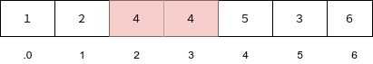
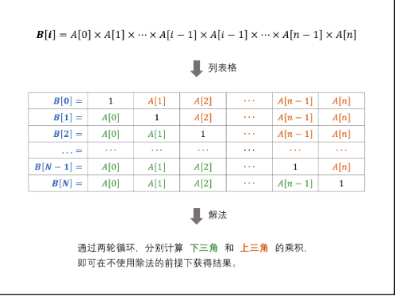

# Python剑指offer打卡-9

[toc]

## 平衡二叉树

- 问题描述

  ```
  题目描述：
  给定一个二叉树，判断它是否是高度平衡的二叉树。
  
  解题方法：
  二叉树的每个节点的左右子树的高度差的绝对值不超过 1，则二叉树是平衡二叉树。根据定义，一棵二叉树是平衡二叉树，
  当且仅当其所有子树也都是平衡二叉树，因此可以使用递归的方式判断二叉树是不是平衡二叉树，递归的顺序可以是自顶向
  下或者自底向上，其中自低向上复杂度最优。
  ```

- 代码

  ```python
  class Solution:
  
      def isBalanced(self, root) -> bool:
          def height(root):
              if not root: return 0
              leftHight = height(root.left)
              rightHight = height(root.right)
              if leftHight == -1 or rightHight == -1 or abs(leftHight - rightHight) > 1:
                  return -1
              else:
                  # 求解当前结点的高度
                  return max(leftHight, rightHight) + 1
  
          return height(root) >= 0
  ```

## 数组中的重复数字

- 问题描述

  ```
  问题描述：
  在一个长度为 n 的数组 nums 里的所有数字都在 0～n-1 的范围内。数组中某些数字是重复的，但不知道有几个数字重复了，也不知道每个数字重复了几次。请找出数组中任意一个重复的数字。
  
  解题方法:
  方法一：
  集合
  方法二：
  重点理解数组元素值的限定问题
  原地交换：索引与值的对应关系（一对多）
  ```

- 代码（[解题思路](https://leetcode-cn.com/problems/shu-zu-zhong-zhong-fu-de-shu-zi-lcof/solution/mian-shi-ti-03-shu-zu-zhong-zhong-fu-de-shu-zi-yua/)）

  
  
  ```python
  class Solution:
  
      def findRepeatNumber(self, nums: [int]) -> int:
          """"集合"""
  
          dic = set()
          for num in nums:
              if num in dic: return num
              dic.add(num)
  
          return -1
  
      def findRepeatNumber_1(self, nums: [int]) -> int:
          """原地交换：索引与值的对应关系"""
          i = 0
          while i < len(nums):
              if nums[i] == i:  # 索引与值相对应
                  i += 1
                  continue
  
              if nums[nums[i]] == nums[i]: return nums[i]  # 索引与值(一对多)重复
              nums[nums[i]], nums[i] = nums[i], nums[nums[i]]  # 交换

          return -1
  ```
## 构建数组乘积

- 问题描述

  ```
  问题描述：
  给定一个数组 A[0,1,…,n-1]，请构建一个数组 B[0,1,…,n-1]，其中B[i] 的值是数组 A 中除了下标 i 以外的元素的积
  , 即B[i]=A[0]×A[1]×…×A[i-1]×A[i+1]×…×A[n-1]。不能使用除法。
  ```

  

- 代码（[解题思路](https://leetcode-cn.com/problems/gou-jian-cheng-ji-shu-zu-lcof/solution/mian-shi-ti-66-gou-jian-cheng-ji-shu-zu-biao-ge-fe/)）

  ```python
  class Solution:
      
      def constructArr(self, a: List[int]) -> List[int]:
          
          b, tmp = [1]*len(a), 1
          
          # 计算下三角(左)
          for i in range(1, len(a)):
              b[i] = b[i - 1] * a[i-1]
              
          for i in range(len(a) - 2, -1, -1):
              tmp *= a[i + 1]  # 计算上三角(右)
              b[i] *= tmp  # 左右相乘(下三角乘以上三角)
          
          return b
  ```

## 正则表达式匹配

- 问题描述
- 代码（[解题思路](https://leetcode-cn.com/problems/zheng-ze-biao-da-shi-pi-pei-lcof/)）

  

  
