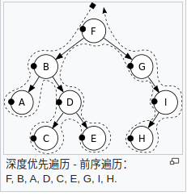
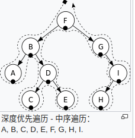
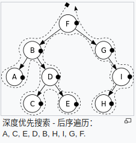
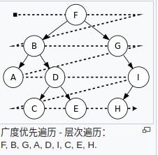

## Python数据结构之二叉树的遍历

​		二叉树是一种非常重要的数据结构，很多其它数据结构都是基于二叉树的基础演变而来的。对于二叉树，有深度遍历和广度遍历，**深度遍历有前序、中序以及后序三种遍历方法**，**广度遍历即我们平常所说的层次遍历**。因为树的定义本身就是递归定义，因此采用递归的方法去实现树的三种遍历不仅容易理解而且代码很简洁。

###　深度遍历

#### 前序遍历



- 非递归

  ```python
  def pre_order(self):
      """前序遍历"""
      if self.root is None:
          return None
  
      stack = []  # 使用栈保存数据
      tmp_node = self.root
      while tmp_node or stack:
          while tmp_node:  # 进栈
              print(tmp_node.val, end=" ")
              stack.append(tmp_node)
              tmp_node = tmp_node.left
  
              #  出栈
              node = stack.pop()
              tmp_node = node.right
  ```

- 递归

  ```python
  def pre_order(self, node):
      """前序遍历"""
      if node is None:
          return
      print(node.val, end=" ")
      self.pre_order(node.left_child)
      self.pre_order(node.right_child)
  ```

#### 中序遍历



- 非递归

  ```python
  def in_order(self):
      """中序遍历"""
      if self.root is None:
          return None
  
      stack = []  # 使用栈保存数据
      tmp_node = self.root
      while tmp_node or stack:
          while tmp_node:  # 进栈
              stack.append(tmp_node)
              tmp_node = tmp_node.left
  
              #  出栈
              node = stack.pop()
              print(node.val, end=" ")
              tmp_node = node.right
  ```

  

- 递归

  ```python
  def in_order(self, node):
      """中序遍历"""
      if node is None:
          return
      self.in_order(node.left_child)
      print(node.val, end=" ")
      self.in_order(node.right_child)
  ```

#### 后序遍历



- 非递归

  ```python
  def post_order(self):
      """后序遍历"""
      if self.root is None:
          return None
  
      stack = []
      tmp_node = self.root
      while tmp_node or stack:
          while tmp_node:
              stack.append(tmp_node)
              tmp_node = tmp_node.left
  
  		#  后序遍历的输出
          node = stack[-1]  # 预先抛出节点，检测所有右端节点是否已经存入
          tmp_node = node.right
          if tmp_node is None:  #
              node = stack.pop()
              print(node.val, end=" ")
              while stack and node == stack[-1].right:  # 输出左右结点之后，输出其根节点
                  node = stack.pop()
                  print(node.val, end=" ")
  
  ```

- 递归

  ```python
  def post_order(self, node):
      """后序遍历"""
      if node is None:
          return
      self.post_order(node.left_child)
      self.post_order(node.right_child)
      print(node.val, end=" ")
  ```

### 广度遍历



``` python
def bro_order(self):
    """层序遍历"""
    if self.root is None:
        return None

    # 使用队列
    queue = [self.root]
    while queue:
        tmp_node = queue.pop(0)
        print(tmp_node.val, end=" ")
        if tmp_node.left_child is not None:
            queue.append(tmp_node.left_child)
            if tmp_node.right_child is not None:
                queue.append(tmp_node.right_child)
```

### 参考

[图片来源]([https://zh.wikipedia.org/wiki/%E6%A0%91%E7%9A%84%E9%81%8D%E5%8E%86](https://zh.wikipedia.org/wiki/树的遍历))

[数据结构与算法 树与树算法（主讲二叉树）最全的二叉树讲解，让你弄懂所有的二叉树！二叉树的遍历 二叉树的非递归遍历 二叉树的深度遍历](https://blog.csdn.net/storyfull/article/details/102994409)

