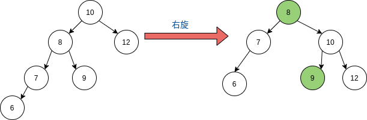
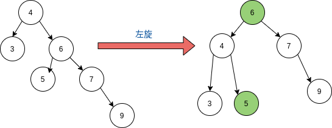
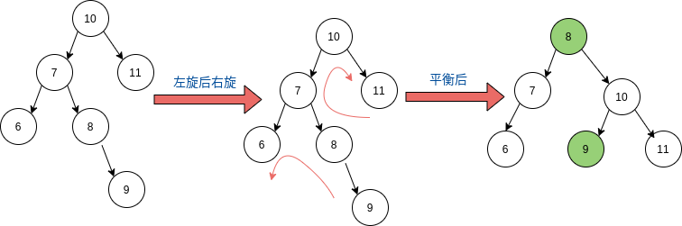
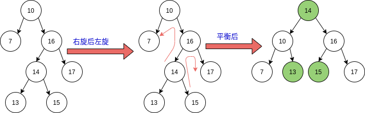

## Python数据结构之平衡二叉树

### 前言

​		平衡二叉树（AVL树）：空树，或者任一结点左、右子树高度差的绝对值不超过1，也即$|BF(T)|<=1$。而平衡因子（BF）,其中$h_L$和$h_R$分别为T的左、右子树的高度。此外，平衡二叉树是在BST上建立而成。BF公式如下:
$$
BF(T) = h_L - h_R
$$

### LL型（右旋）

#### 图示



#### 代码

```python
    def right_rotate(node):
        """LL型，右旋"""

        if node is None:
            return
        # 创建新的结点，保存左旋后的结点
        new_node = copy.deepcopy(node)
        new_node.right = node.right
        new_node.left = node.left.right

        # 连接新的左右结点
        node.val = node.left.val
        node.left = node.left.left
        node.right = new_node

```

**结果**：

```python
LL未平衡： 6 7 8 9 10 12 
LL平衡后： 8 7 6 10 9 12 
```

### RR型（左旋）

#### 图示



#### 代码

```python
    def left_rotate(node):
        """RR型，左旋"""

        if node is None:
            return

        # 创建新的结点，保存左旋后的结点
        new_node = copy.deepcopy(node)
        new_node.left = node.left
        new_node.right = node.right.left

        # 连接新的左右结点
        node.val = node.right.val
        node.right = node.right.right
        node.left = new_node
```

**结果**：

```python
RR未平衡： 3 4 5 6 7 8 
RR平衡后： 6 4 3 5 7 8 
```

### 混合型

#### 图示

- **LR型**

  

- **RL型**

  

#### 代码

```python
    def jude_node(self, node):
        """判断二叉树是否平衡"""

        # 　1.右子树高于左子树，
        if self.get_right_height(node) - self.get_left_height(node) > 1:
            if node.right and self.get_left_height(node.right) > 				                							self.get_right_height(node.right):
                # RL型，右旋后左旋
                self.right_rotate(node.right)
                self.left_rotate(self.root)
            else:
                self.left_rotate(self.root)

            return

        # 2.左子树高于右子树
        if self.get_left_height(node) - self.get_right_height(node) > 1:
            if node.left and self.get_right_height(node.left) >                                 						self.get_left_height(node.left):
                
                # LR型，左旋后右旋
                self.left_rotate(node.left)
                self.right_rotate(self.root)
            else:
                self.right_rotate(self.root)
```

**结果**：

```python
LR未平衡： 6 7 8 9 10 11 
LR平衡后： 8 7 6 10 9 11 
RL未平衡： 7 10 13 14 15 16 17 
RL平衡后： 14 10 7 13 16 15 17 
```

### 参考

[数据结构与算法--平衡二叉树/AVL树 一步一步带你用Python完整实现平衡二叉树/AVL树 Python实现平衡二叉树/AVL树的调整 AVL树结点/节点的调整](https://blog.csdn.net/storyfull/article/details/103833760)

[中国大学mooc数据结构](https://www.icourse163.org/course/ZJU-93001)