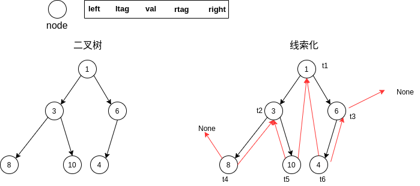

## Python数据结构之线索二叉树和顺序存储

### 二叉树顺序存储

#### 顺序存储原则


１）顺序存储只考虑完全二叉树(结点索引以零开头)
２）第ｎ个元素的左子节点２*n + 1
３）第ｎ个元素的右子节点２*n + 2
４）第n个元素的父结点（n-1）/ 2

#### 代码

​		先序、中序和后序遍历的代码实现过程可以与递归算法进行类别。

```python
class ArrayBinaryTree:

    def __init__(self, array):
        self.array = array

    def pre_order(self, index):
        """　前序　"""
        if self.array is None or len(self.array) == 0:
            print("空数组")
        print(self.array[index], end=" ")

        if (2*index + 1) < len(self.array):
            self.pre_order(2*index + 1)
        if (2*index + 2) < len(self.array):
            self.pre_order(2*index + 2)

    def in_order(self, index):
        """　中序　"""
        if self.array is None or len(self.array) == 0:
            print("空数组")

        if (2*index + 1) < len(self.array):
            self.pre_order(2*index + 1)
        print(self.array[index], end=" ")

        if (2*index + 2) < len(self.array):
            self.pre_order(2*index + 2)

    def post_order(self, index):
        """ 后序　"""
        if self.array is None or len(self.array) == 0:
            print("空数组")

        if (2*index + 1) < len(self.array):
            self.pre_order(2*index + 1)
        if (2*index + 2) < len(self.array):
            self.pre_order(2*index + 2)

        print(self.array[index], end=" ")
```

### 线索二叉树

​		线索二叉树概念部分可以阅读：[理解线索二叉树](https://www.jianshu.com/p/deb1d2f2549a)，编码过程中注意前驱结点和后继结点的指向。

#### 中序线索化

```python
    def threaded_node(self, node):
        """中序线索结点"""
        
        if node is None:
            return

        self.threaded_node(node.left)

        # 线索左结点,并且线索化
        if node.left is None:
            node.left = self.pre
            node.ltag = 1
        if self.pre and self.pre.right is None:
            self.pre.right = node
            self.pre.rtag = 1
        self.pre = node  # 结点处理完成之后，保证当前结点为下一个结点的前驱结点

        self.threaded_node(node.right)
```

#### 中序线索遍历

``` python
    def thread_in_order(node):
        """中序遍历线索二叉树"""

        if node is None:
            return
        temp_node = node
        while temp_node:
            # 找到出事的线索起点
            while temp_node.ltag == 0:
                temp_node = temp_node.left

            print(temp_node.val, end=" ")

            while temp_node.rtag == 1:
                temp_node = temp_node.right
                print(temp_node.val, end=" ")
            temp_node = temp_node.right
```

#### 例题



输出结果：

```python 
8 3 10 1 14 6 线索前： 
t5结点： 10
t5前驱结点： 3
t5后继结点： 1
t5的指示标： 1 1
t4的前驱结点： None
t3的后继结点： None
线索后： 8 3 10 1 14 6
```

### 参考

[Python实现线索化二叉树 Python实现线索化存储二叉树 Python线索化二叉树的遍历](https://blog.csdn.net/storyfull/article/details/103744339)

[理解线索二叉树](https://www.jianshu.com/p/deb1d2f2549a)

[Python实现顺序存储二叉树 顺序存储二叉树的遍历](https://blog.csdn.net/storyfull/article/details/103741022)